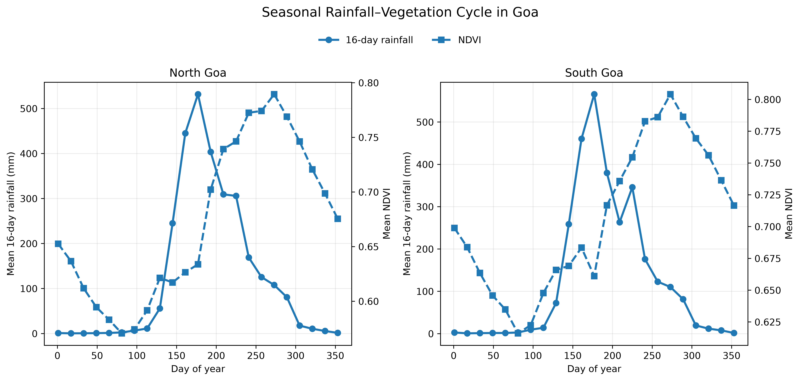
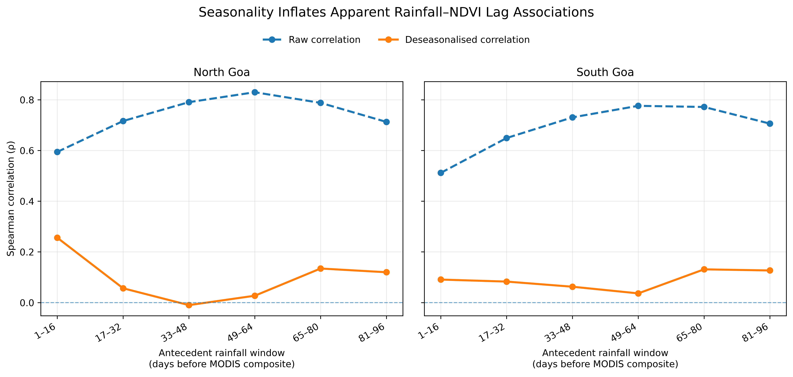
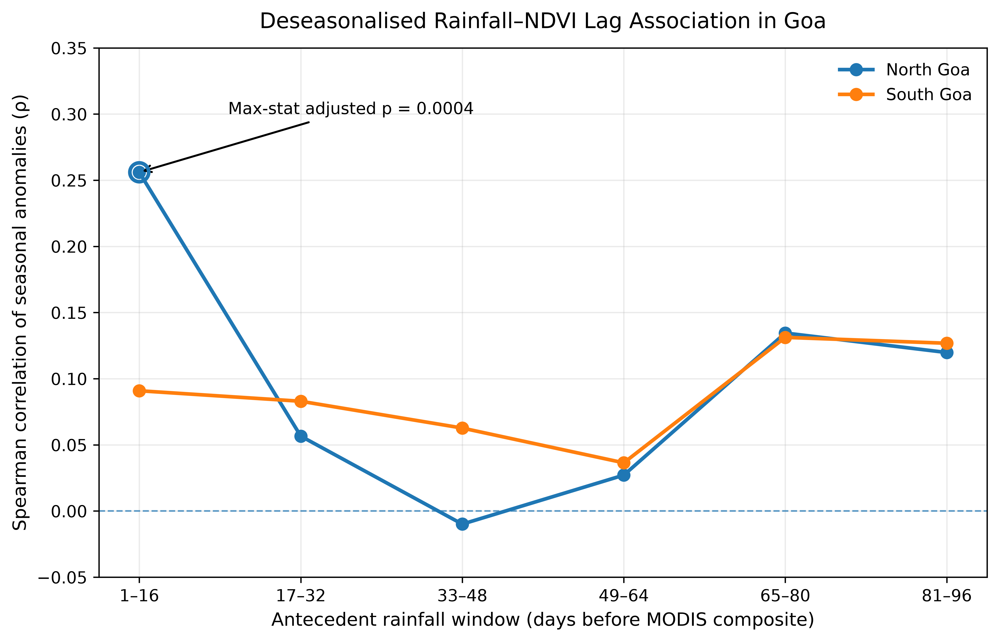
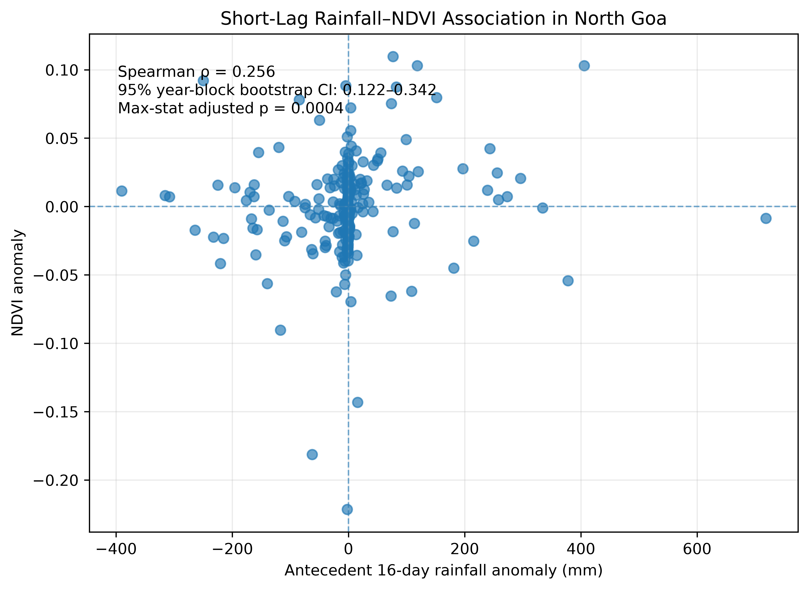

```{=html}
<div class="lag-hero">
  <h1>How Fast Does Vegetation Respond to the Monsoon?</h1>
  <p>A district-scale rainfall–NDVI lag analysis for Goa using Google Earth Engine for geospatial processing and Python for time-series inference.</p>
  <div class="lag-badges">
    <span class="lag-badge">Google Earth Engine</span>
    <span class="lag-badge">Python</span>
    <span class="lag-badge">CHIRPS Rainfall</span>
    <span class="lag-badge">MODIS NDVI</span>
    <span class="lag-badge">2015–2025</span>
  </div>
</div>
```

## The Question

The monsoon transforms Goa's landscape within weeks. Rainfall rises rapidly, soils become wet, crops establish, and natural vegetation turns greener. That seasonal transition raises a deceptively simple question:

> **How quickly is vegetation greenness associated with rainfall during the monsoon cycle?**

My first idea was straightforward. I would calculate rainfall totals for several time windows before each MODIS NDVI observation, correlate rainfall with NDVI, and identify the lag with the strongest relationship. If the maximum correlation occurred 16, 32, or 64 days before the NDVI composite, that would appear to indicate a characteristic vegetation-response time.

The analysis did produce a clear answer at first. In North Goa, the raw rainfall–NDVI correlation increased from **0.59 at a 1–16 day antecedent window to 0.83 at 49–64 days**. South Goa showed a similarly broad long-lag peak.

But that answer was misleading.

The monsoon itself creates a strong annual sequence: rainfall increases first, vegetation becomes greener later, and both variables decline as the season ends. A lag correlation can therefore recover the **calendar of the monsoon** rather than an interannual vegetation response to unusually wet or dry conditions.

::: {.lag-card .theory}
<div class="lag-card-title">The central analytical problem</div>

A high lagged correlation does not automatically mean that rainfall at that lag caused a vegetation response. When rainfall and NDVI both follow strong seasonal cycles, the apparent lag may largely reflect their shared position within the annual monsoon sequence.
:::

This blog documents how I built the workflow, discovered that problem, and changed the analysis. The final approach combines **Google Earth Engine (GEE)** for cloud-based geospatial extraction with **Python** for temporal alignment, deseasonalisation, lag analysis, and time-series-aware inference. GEE is designed for large-scale geospatial analysis [@gorelick2017], while CHIRPS provides a long daily gridded rainfall record [@funk2015] and MOD13Q1 provides 16-day vegetation-index composites at 250 m [@didan2021].

::: {.lag-card .tip}
<div class="lag-card-title">Workflow at a glance</div>

Define Goa districts in GEE → extract CHIRPS daily rainfall → evaluate MODIS NDVI quality masks → quantify valid spatial coverage → align rainfall with 16-day MODIS composites → construct six antecedent rainfall windows → remove the mean seasonal cycle → test lag associations with year-block permutation and maximum-statistic correction → assess robustness with leave-one-year-out analysis and year-block bootstrap.
:::

```{=html}
<div class="lag-grid">
  <div class="lag-tile"><div class="ico">🌧️</div><div class="lab">Rainfall</div><div class="sub">Daily CHIRPS district means</div></div>
  <div class="lag-tile"><div class="ico">🌿</div><div class="lab">Vegetation</div><div class="sub">16-day MODIS NDVI</div></div>
  <div class="lag-tile"><div class="ico">⏱️</div><div class="lab">Lag windows</div><div class="sub">Six antecedent 16-day blocks</div></div>
  <div class="lag-tile"><div class="ico">🧪</div><div class="lab">Inference</div><div class="sub">Block permutation and bootstrap</div></div>
</div>
```

---

```{=html}
<div class="lag-step"><div class="lag-step-num">1</div><h2>Study Design and Data</h2></div>
```

The study compared **North Goa** and **South Goa** over **2015–2025**. Rainfall came from the CHIRPS Daily product, which combines satellite information with station data at 0.05° resolution [@funk2015]. Vegetation greenness came from the MODIS MOD13Q1 Version 6.1 product, a 16-day 250 m vegetation-index product [@didan2021].

I kept the two roles of the analytical stack deliberately separate. GEE handled spatial computation over thousands of raster images. Python handled the statistical workflow after district-level extraction.

| Component | Choice used in the analysis |
|---|---|
| Study area | North Goa and South Goa districts |
| Analysis period | 2015–2025 |
| Administrative boundary | FAO GAUL 2015 level-2 units |
| Rainfall | CHIRPS Daily precipitation |
| Vegetation | MODIS MOD13Q1 V6.1 NDVI |
| NDVI temporal resolution | 16-day composite |
| NDVI quality rule | `SummaryQA <= 1`, with valid spatial coverage retained as a diagnostic |
| Antecedent rainfall windows | Six non-overlapping 16-day windows covering 1–96 days before each MODIS composite |
| Association measure | Spearman rank correlation |
| Seasonality control | District- and MODIS-period-specific anomalies |
| Primary inference | Year-block permutation with six-lag maximum-statistic correction |
| Robustness checks | Coverage sensitivity, leave-one-year-out analysis, and year-block bootstrap |

: Study design and analytical choices. {#tbl-design}

### Why I used the MODIS composite start date carefully

MOD13Q1 is not an instantaneous image taken on a single day. The MODIS vegetation-index compositing algorithm selects a representative value for each pixel from observations within the 16-day compositing period [@modisvi2021]. Adjacent pixels may even be represented by observations from different days within that period.

That matters for rainfall alignment. Rainfall during the same 16-day MODIS period can partly occur **after** the observation selected for a given pixel. I therefore retained same-window rainfall as a descriptive variable, but treated rainfall windows **before the composite start date** as the main antecedent variables.

::: {.lag-card .warn}
<div class="lag-card-title">Association, not a causal response time</div>

The analysis identifies lagged rainfall–NDVI associations at district scale. It does not establish a causal physiological response time. NDVI integrates crops, plantations, forests, grasslands, and other vegetation, while rainfall can affect greenness through soil moisture, management, cloud contamination, phenology, and other pathways.
:::

### The seasonal pattern appears before any correlation is calculated

The first diagnostic was a climatology of mean 16-day rainfall and mean NDVI for each MODIS composite period. @fig-seasonal shows the seasonal cycles for both districts.

{#fig-seasonal fig-alt="Two-panel seasonal climatology for North Goa and South Goa showing 16-day rainfall peaking earlier than MODIS NDVI." width=100%}

The displacement is visually obvious. Rainfall rises rapidly during the early monsoon and reaches its maximum before the NDVI peak. Vegetation greenness remains high after rainfall has already begun to decline. This is precisely the kind of seasonal structure that can generate a strong raw lag correlation.

::: {.lag-concept}
#### Why the seasonal cycle matters

Suppose rainfall is consistently highest in June and July, while NDVI is consistently highest in August and September. A correlation between August NDVI and rainfall several 16-day periods earlier may be high even if year-to-year departures from normal rainfall have little relationship with year-to-year departures from normal NDVI.

The raw analysis therefore asks, in part, **"where are we in the monsoon calendar?"** The stronger scientific question is: **"when rainfall is wetter or drier than usual for this seasonal period, is vegetation also greener or less green than usual after a particular lag?"**
:::

This distinction became the turning point of the analysis.

---

```{=html}
<div class="lag-step"><div class="lag-step-num">2</div><h2>Setting Up Earth Engine and the Goa Districts</h2></div>
```

I used the Earth Engine Python API inside JupyterLab. A light environment was sufficient; I deliberately avoided adding a large geospatial Python stack because GEE performed the raster processing remotely.

```bash
conda create -n gee_nrm python=3.11 pip -y
conda activate gee_nrm
python -m pip install earthengine-api jupyterlab pandas numpy scipy matplotlib
jupyter lab
```

After authenticating Earth Engine, I initialised it with my Google Cloud project.

```{python}
import ee
import numpy as np
import pandas as pd
import matplotlib.pyplot as plt

from pathlib import Path
from scipy.stats import spearmanr

ee.Authenticate()
ee.Initialize(project="ee-subhradip-gis")

print("Earth Engine server response:", ee.Number(25).sqrt().getInfo())
```

I used FAO GAUL 2015 level-2 administrative boundaries and filtered by country and first-level administrative unit.

```{python}
admin2 = ee.FeatureCollection("FAO/GAUL/2015/level2")

goa_districts = (
    admin2
    .filter(ee.Filter.eq("ADM0_NAME", "India"))
    .filter(ee.Filter.eq("ADM1_NAME", "Goa"))
)

print("Number of districts:", goa_districts.size().getInfo())
print("District names:", goa_districts.aggregate_array("ADM2_NAME").getInfo())

north_goa = ee.Feature(
    goa_districts
    .filter(ee.Filter.eq("ADM2_NAME", "North Goa"))
    .first()
)

south_goa = ee.Feature(
    goa_districts
    .filter(ee.Filter.eq("ADM2_NAME", "South Goa"))
    .first()
)

goa = goa_districts.geometry()
```

The geometry check returned two districts. The calculated district areas were approximately **1,693 km² for North Goa** and **1,992 km² for South Goa**, with a combined area of about **3,685 km²**.

::: {.lag-protip}
**Practical lesson:** verify administrative names and geometry counts before running a long extraction. A spelling mismatch in `ADM1_NAME` or `ADM2_NAME` can silently leave you with an empty collection and waste time later.
:::

---

```{=html}
<div class="lag-step"><div class="lag-step-num">3</div><h2>Extracting Daily CHIRPS Rainfall Efficiently</h2></div>
```

The rainfall source was the Earth Engine collection `UCSB-CHG/CHIRPS/DAILY`. CHIRPS provides daily precipitation as a gridded rainfall field [@funk2015].

Because I needed six 16-day antecedent windows for the first NDVI observation and a complete same-window period for the final observation, the full rainfall extraction range was larger than the nominal 2015–2025 study period:

```text
2014-09-27  →  2026-01-03
```

The extra dates ensured that the earliest six-lag window and the final 16-day composite window were complete.

```{python}
chirps = ee.ImageCollection("UCSB-CHG/CHIRPS/DAILY")

chirps_complete = (
    chirps
    .filterDate("2014-09-27", "2026-01-04")
    .filterBounds(goa)
    .sort("system:time_start")
)

print("Daily CHIRPS images:", chirps_complete.size().getInfo())
```

### The first Earth Engine scaling problem

My first implementation mapped `reduceRegions()` over every daily image. It worked for a 10-day test, but a longer run triggered:

```text
EEException: Too many concurrent aggregations.
```

The fix was to change the computation pattern.

Instead of:

```text
4,117 images × one reduceRegions() call per image
```

I used:

```text
ImageCollection → sort → toBands() → one reduceRegions() call
```

Earth Engine's `toBands()` converts an ordered image collection into one multiband image. The method supports up to 5,000 output bands, so the 4,117 daily CHIRPS images used here fit within that limit. The band order follows the collection order, which is why I sorted by `system:time_start` first.

```{python}
chirps_stack = chirps_complete.toBands()

chirps_scale = (
    ee.Image(chirps_complete.first())
    .select("precipitation")
    .projection()
    .nominalScale()
    .getInfo()
)

rainfall_wide = chirps_stack.reduceRegions(
    collection=goa_districts,
    reducer=ee.Reducer.mean(),
    scale=chirps_scale,
    tileScale=2
)

rainfall_wide_df = ee.data.computeFeatures(
    {
        "expression": rainfall_wide,
        "fileFormat": "PANDAS_DATAFRAME"
    }
)
```

The result was only **two feature records**, one per district, but each record contained thousands of daily rainfall properties. I then reshaped the wide Earth Engine output in Pandas.

```{python}
rainfall_columns = [
    column
    for column in rainfall_wide_df.columns
    if column.endswith("_precipitation")
]

rainfall_complete = (
    rainfall_wide_df
    .melt(
        id_vars=["ADM2_NAME"],
        value_vars=rainfall_columns,
        var_name="rainfall_band",
        value_name="rainfall_mm"
    )
    .rename(columns={"ADM2_NAME": "district"})
)

rainfall_complete["date"] = pd.to_datetime(
    rainfall_complete["rainfall_band"]
    .str.extract(r"(\d{8})")[0],
    format="%Y%m%d"
)

rainfall_complete = (
    rainfall_complete[
        ["date", "district", "rainfall_mm"]
    ]
    .sort_values(["date", "district"])
    .reset_index(drop=True)
)
```

### Rainfall validation

The final daily series contained **4,117 consecutive dates per district**, from 27 September 2014 to 3 January 2026. There were:

```text
8,234 rows
0 missing rainfall values
0 duplicate date–district records
4,117 dates per district
continuous daily spacing in both districts
```

A quick annual check also made physical sense. For 2015, the district-average CHIRPS totals were about **1,990 mm in North Goa** and **2,282 mm in South Goa**, with the major rainfall concentration in the monsoon months.

::: {.lag-card .tip}
<div class="lag-card-title">What GEE did well here</div>

GEE handled the expensive spatial reduction. Pandas handled the cheap tabular reshaping. Moving the district-level result to Python only after the raster computation kept the workflow simple and avoided transferring thousands of raster images locally.
:::

---

```{=html}
<div class="lag-step"><div class="lag-step-num">4</div><h2>MODIS NDVI: Quality Masking Was the Hard Part</h2></div>
```

The vegetation source was `MODIS/061/MOD13Q1`. The NDVI band uses a scale factor of `0.0001`, and the product provides both detailed and summary quality information [@didan2021; @modisvi2021].

```{python}
modis = ee.ImageCollection("MODIS/061/MOD13Q1")

modis_goa = (
    modis
    .filterDate("2015-01-01", "2026-01-01")
    .filterBounds(goa)
)

print("Number of MODIS composites:", modis_goa.size().getInfo())
```

The collection contained **253 composite images** for the 2015–2025 period.

### Why I did not simply use the strictest mask

The summary QA band classifies pixels as:

```text
0 = good data, use with confidence
1 = marginal data, useful but inspect detailed QA
2 = snow/ice
3 = cloudy
```

A strict `SummaryQA == 0` mask initially looked like the obvious scientific choice. But Goa's monsoon cloud cover changed the problem. A strict mask removed so much of the district area that many composites had very little or no valid NDVI coverage.

I therefore tested four QA strategies and calculated the valid spatial coverage of every district–composite observation.

| QA strategy | District | Mean coverage (%) | Median coverage (%) | Composites with zero coverage |
|---|---|---:|---:|---:|
| `SummaryQA == 0` | North Goa | 38.85 | 31.79 | 35 |
| `SummaryQA == 0` | South Goa | 37.94 | 22.05 | 27 |
| DetailedQA conservative | North Goa | 61.64 | 96.28 | 28 |
| DetailedQA conservative | South Goa | 59.92 | 95.08 | 24 |
| DetailedQA pragmatic | North Goa | 65.04 | 97.07 | 15 |
| DetailedQA pragmatic | South Goa | 63.85 | 95.74 | 14 |
| **`SummaryQA <= 1`** | **North Goa** | **70.18** | **97.94** | **8** |
| **`SummaryQA <= 1`** | **South Goa** | **69.26** | **97.06** | **5** |

: Comparison of tested MODIS NDVI quality-masking strategies. {#tbl-qa}

I selected `SummaryQA <= 1` for the primary district-scale analysis. This retains good and marginally useful VI pixels while excluding snow/ice and cloudy summary classes. Crucially, I did **not** hide the remaining data-quality problem. I retained `valid_coverage_pct` for every NDVI observation and later tested coverage thresholds as a sensitivity analysis.

```{python}
def prepare_ndvi_summary_qa_01(image):
    quality_mask = (
        image
        .select("SummaryQA")
        .lte(1)
    )

    ndvi = (
        image
        .select("NDVI")
        .multiply(0.0001)
        .updateMask(quality_mask)
        .rename("NDVI")
    )

    return ndvi.copyProperties(
        image,
        ["system:time_start"]
    )


modis_ndvi_final = (
    modis_goa
    .map(prepare_ndvi_summary_qa_01)
    .sort("system:time_start")
)
```

### Quantifying valid spatial coverage

I created a pixel-area image using the NDVI mask and summed valid pixel area within each district.

```{python}
def make_valid_area_image(image):
    valid_mask = image.mask().select("NDVI")

    valid_area = (
        ee.Image.pixelArea()
        .updateMask(valid_mask)
        .rename("valid_area")
    )

    return valid_area.copyProperties(
        image,
        ["system:time_start"]
    )
```

I converted the valid-area collection to bands, reduced it over the two districts, and reshaped it in the same way as the rainfall table.

```{python}
valid_area_collection = modis_ndvi_final.map(
    make_valid_area_image
)

valid_area_stack = (
    valid_area_collection
    .sort("system:time_start")
    .toBands()
)

coverage_wide = valid_area_stack.reduceRegions(
    collection=goa_districts,
    reducer=ee.Reducer.sum(),
    scale=modis_scale,
    tileScale=2
)

coverage_wide_df = ee.data.computeFeatures(
    {
        "expression": coverage_wide,
        "fileFormat": "PANDAS_DATAFRAME"
    }
)

coverage_columns = [
    column
    for column in coverage_wide_df.columns
    if column.endswith("_valid_area")
]

summary01_coverage = (
    coverage_wide_df
    .melt(
        id_vars=["ADM2_NAME"],
        value_vars=coverage_columns,
        var_name="coverage_band",
        value_name="valid_area_m2"
    )
    .rename(columns={"ADM2_NAME": "district"})
)

summary01_coverage["date"] = pd.to_datetime(
    summary01_coverage["coverage_band"]
    .str.extract(r"(\d{4}_\d{2}_\d{2})")[0],
    format="%Y_%m_%d"
)

district_area_lookup = {
    "North Goa": north_goa.geometry().area().getInfo(),
    "South Goa": south_goa.geometry().area().getInfo()
}

summary01_coverage["district_area_m2"] = (
    summary01_coverage["district"]
    .map(district_area_lookup)
)

summary01_coverage["valid_coverage_pct"] = (
    summary01_coverage["valid_area_m2"]
    / summary01_coverage["district_area_m2"]
    * 100
)

summary01_coverage = summary01_coverage[
    [
        "date",
        "district",
        "valid_area_m2",
        "district_area_m2",
        "valid_coverage_pct"
    ]
]
```

The final NDVI dataset contained **506 district–composite records**. Exactly **13 NDVI values were missing**, and every one of those 13 observations had **0% valid spatial coverage**. No missing NDVI value occurred when valid coverage was above zero.

::: {.lag-card .result}
<div class="lag-card-title">QA result</div>

The 13 missing NDVI values were not random software errors. They were completely explained by zero valid MODIS coverage after QA masking: 8 North Goa composites and 5 South Goa composites.
:::

### Extracting the district mean NDVI series

I used the same multiband pattern as the rainfall workflow.

```{python}
ndvi_final_stack = modis_ndvi_final.toBands()

modis_scale = (
    ee.Image(modis_ndvi_final.first())
    .select("NDVI")
    .projection()
    .nominalScale()
    .getInfo()
)

ndvi_full_wide = ndvi_final_stack.reduceRegions(
    collection=goa_districts,
    reducer=ee.Reducer.mean(),
    scale=modis_scale,
    tileScale=2
)

ndvi_full_wide_df = ee.data.computeFeatures(
    {
        "expression": ndvi_full_wide,
        "fileFormat": "PANDAS_DATAFRAME"
    }
)

ndvi_columns = [
    column
    for column in ndvi_full_wide_df.columns
    if column.endswith("_NDVI")
]

ndvi_long = ndvi_full_wide_df.melt(
    id_vars=["ADM2_NAME"],
    value_vars=ndvi_columns,
    var_name="ndvi_band",
    value_name="ndvi"
)

ndvi_long = ndvi_long.rename(
    columns={"ADM2_NAME": "district"}
)

ndvi_long["date"] = pd.to_datetime(
    ndvi_long["ndvi_band"]
    .str.extract(r"(\d{4}_\d{2}_\d{2})")[0],
    format="%Y_%m_%d"
)

ndvi_long = (
    ndvi_long[["date", "district", "ndvi"]]
    .sort_values(["date", "district"])
    .reset_index(drop=True)
)

ndvi_final = ndvi_long.merge(
    summary01_coverage[
        ["date", "district", "valid_coverage_pct"]
    ],
    on=["date", "district"],
    how="left",
    validate="one_to_one"
)
```

The `validate="one_to_one"` argument made the date–district key check explicit. The scaled NDVI values ranged from **0.338 to 0.837**, with no values outside the theoretical `-1` to `1` range.

---

```{=html}
<div class="lag-step"><div class="lag-step-num">5</div><h2>Aligning Rainfall with the 16-Day MODIS Calendar</h2></div>
```

I tested six non-overlapping antecedent rainfall windows. Each window contained exactly 16 daily CHIRPS observations.

```text
Lag 1 = days  -16 to  -1   →  1–16 days before composite
Lag 2 = days  -32 to -17   → 17–32 days before composite
Lag 3 = days  -48 to -33   → 33–48 days before composite
Lag 4 = days  -64 to -49   → 49–64 days before composite
Lag 5 = days  -80 to -65   → 65–80 days before composite
Lag 6 = days  -96 to -81   → 81–96 days before composite
```

For the MODIS composite starting on `2015-01-01`, the six windows were:

```text
Lag 1   2014-12-16 → 2014-12-31
Lag 2   2014-11-30 → 2014-12-15
Lag 3   2014-11-14 → 2014-11-29
Lag 4   2014-10-29 → 2014-11-13
Lag 5   2014-10-13 → 2014-10-28
Lag 6   2014-09-27 → 2014-10-12
```

The following code constructs the same-window and six antecedent rainfall totals for every district–NDVI observation.

```{python}
aligned_records = []

for row in ndvi_final.itertuples(index=False):
    district_rainfall = (
        rainfall_complete[
            rainfall_complete["district"] == row.district
        ]
        .set_index("date")["rainfall_mm"]
        .sort_index()
    )

    record = {
        "date": row.date,
        "district": row.district,
        "ndvi": row.ndvi,
        "valid_coverage_pct": row.valid_coverage_pct
    }

    # Same 16-day MODIS composite window
    same_start = row.date
    same_end = row.date + pd.Timedelta(days=15)
    same_window = district_rainfall.loc[same_start:same_end]

    record["rainfall_same_window_mm"] = same_window.sum()

    # Six antecedent 16-day windows
    for lag in range(1, 7):
        window_start = row.date - pd.Timedelta(days=16 * lag)
        window_end = row.date - pd.Timedelta(
            days=16 * (lag - 1) + 1
        )

        rainfall_window = district_rainfall.loc[
            window_start:window_end
        ]

        if len(rainfall_window) != 16:
            raise ValueError(
                f"Incomplete rainfall window: {row.district}, "
                f"{row.date}, lag {lag}"
            )

        record[f"rainfall_lag{lag}_mm"] = rainfall_window.sum()

    aligned_records.append(record)


lagged_dataset = (
    pd.DataFrame(aligned_records)
    .sort_values(["date", "district"])
    .reset_index(drop=True)
)
```

I manually recalculated all six windows for the first North Goa observation. Every stored rainfall total matched the manual sum exactly, with a difference of `0.0`.

The final lagged analytical table contained:

```text
506 district–composite records
253 composites per district
493 valid NDVI observations
13 zero-coverage NDVI observations retained as missing
0 missing rainfall values
0 duplicate date–district records
```

---

```{=html}
<div class="lag-step"><div class="lag-step-num">6</div><h2>The Apparent Lag: Raw Correlation Gives a Convincing but Incomplete Answer</h2></div>
```

The first analysis was a simple Spearman correlation between NDVI and each antecedent rainfall window.

```{python}
lag_variable_map = [
    (1, "rainfall_lag1_mm"),
    (2, "rainfall_lag2_mm"),
    (3, "rainfall_lag3_mm"),
    (4, "rainfall_lag4_mm"),
    (5, "rainfall_lag5_mm"),
    (6, "rainfall_lag6_mm")
]

raw_results = []

for district in ["North Goa", "South Goa"]:
    district_data = lagged_dataset[
        lagged_dataset["district"] == district
    ]

    for lag, rainfall_column in lag_variable_map:
        pairs = district_data[
            ["ndvi", rainfall_column]
        ].dropna()

        rho, p_value = spearmanr(
            pairs["ndvi"],
            pairs[rainfall_column]
        )

        raw_results.append(
            {
                "district": district,
                "lag": lag,
                "rho": rho,
                "p_value": p_value
            }
        )

raw_results = pd.DataFrame(raw_results)
```

The raw pattern was striking:

```text
North Goa raw ρ:
Lag 1  0.594
Lag 2  0.716
Lag 3  0.791
Lag 4  0.830  ← maximum
Lag 5  0.788
Lag 6  0.713

South Goa raw ρ:
Lag 1  0.512
Lag 2  0.649
Lag 3  0.731
Lag 4  0.776  ← maximum
Lag 5  0.772
Lag 6  0.706
```

A naïve interpretation would be tempting: **vegetation responds most strongly to rainfall from 49–64 days earlier**.

But @fig-raw-deseasonalised shows why that interpretation is unsafe.

{#fig-raw-deseasonalised fig-alt="Two-panel lag-response plots for North and South Goa showing high raw correlations and much weaker deseasonalised correlations." width=100%}

The raw curves are broad, smooth, and high. They look exactly like a shifted seasonal cycle. Once the average annual timing is removed, the strong 49–64 day peak largely disappears.

::: {.lag-card .result}
<div class="lag-card-title">The methodological result was more important than the first ecological result</div>

Raw lag correlation suggested a strong 49–64 day response. Deseasonalisation showed that most of this apparent lag was the shared monsoon calendar. The question changed from "what lag has the highest raw correlation?" to "what lag remains associated with NDVI after the expected seasonal cycle is removed?"
:::

---

```{=html}
<div class="lag-step"><div class="lag-step-num">7</div><h2>Removing the Mean Seasonal Cycle</h2></div>
```

MODIS provides 23 composite periods in each year of this analysis, with start-day-of-year values:

```text
1, 17, 33, 49, 65, 81, 97, 113, 129, 145, 161, 177,
193, 209, 225, 241, 257, 273, 289, 305, 321, 337, 353
```

For each district and MODIS day-of-year period, I calculated the 2015–2025 mean and subtracted it from the observed value.

For NDVI:

$$
NDVI'_{y,d} = NDVI_{y,d} - \overline{NDVI}_{d}
$$

For each rainfall lag:

$$
R'_{y,d,l} = R_{y,d,l} - \overline{R}_{d,l}
$$

where $y$ is year, $d$ is the MODIS composite day-of-year period, and $l$ is rainfall lag.

```{python}
anomaly_data = lagged_dataset.copy()

anomaly_data["doy"] = anomaly_data["date"].dt.dayofyear

anomaly_data["ndvi_anomaly"] = (
    anomaly_data["ndvi"]
    - anomaly_data
      .groupby(["district", "doy"])["ndvi"]
      .transform("mean")
)

rainfall_variables = [
    "rainfall_same_window_mm",
    "rainfall_lag1_mm",
    "rainfall_lag2_mm",
    "rainfall_lag3_mm",
    "rainfall_lag4_mm",
    "rainfall_lag5_mm",
    "rainfall_lag6_mm"
]

for variable in rainfall_variables:
    anomaly_column = variable.replace("_mm", "_anomaly")

    anomaly_data[anomaly_column] = (
        anomaly_data[variable]
        - anomaly_data
          .groupby(["district", "doy"])[variable]
          .transform("mean")
    )
```

The mean of every anomaly variable was essentially zero. The residual values now represented **wetter or drier than usual** and **greener or less green than usual** conditions for the same district and seasonal period.

### The deseasonalised correlation pattern

The all-valid anomaly correlations were:

| District | 1–16 d | 17–32 d | 33–48 d | 49–64 d | 65–80 d | 81–96 d |
|---|---:|---:|---:|---:|---:|---:|
| North Goa | **0.256** | 0.057 | -0.010 | 0.027 | 0.135 | 0.120 |
| South Goa | 0.091 | 0.083 | 0.063 | 0.036 | 0.131 | 0.127 |

: Spearman correlations between rainfall anomalies and NDVI anomalies in the primary all-valid analysis. {#tbl-anomaly-rho}

North Goa now showed a short-lag peak at **1–16 days**, while South Goa showed only weak positive coefficients distributed across several lags.

This was much more plausible statistically than the raw broad Lag 4 peak, but one problem remained: the observations were a time series.

---

```{=html}
<div class="lag-step"><div class="lag-step-num">8</div><h2>Serial Dependence Changes the Significance Test</h2></div>
```

The NDVI anomalies retained substantial serial autocorrelation.

```text
North Goa NDVI anomaly Spearman autocorrelation:
lag 1 = 0.589
lag 2 = 0.418
lag 3 = 0.336
lag 4 = 0.324
lag 5 = 0.314
lag 6 = 0.281

South Goa NDVI anomaly Spearman autocorrelation:
lag 1 = 0.390
lag 2 = 0.309
lag 3 = 0.287
lag 4 = 0.212
lag 5 = 0.229
lag 6 = 0.202
```

The rainfall anomalies were much less serially dependent, but the NDVI result was enough to make ordinary correlation p-values unsuitable as the final inference. Permuting individual 16-day observations would also break the temporal structure.

I therefore used **year blocks**. Each year contained the same 23 MODIS composite periods. The rainfall year blocks were permuted relative to the fixed NDVI year blocks, preserving the within-year rainfall sequence.

```text
Observed pairing:
NDVI 2015 ↔ rainfall 2015
NDVI 2016 ↔ rainfall 2016
...

One possible permutation:
NDVI 2015 ↔ rainfall 2021
NDVI 2016 ↔ rainfall 2018
...
```

Block-based resampling is a standard way to retain dependence within groups or temporal blocks [@lahiri2003].

### Why I used a maximum statistic across six lags

There was another issue. I tested six antecedent lags and then looked for the strongest one. If I used six separate unadjusted tests, the chance of selecting an apparently unusual lag would increase.

For each of **9,999 year-block permutations**, I therefore calculated all six Spearman correlations and stored:

$$
T_{max} = \max_{l \in \{1,\ldots,6\}} |\rho_l|
$$

The adjusted p-value for each observed lag was based on the permutation distribution of the maximum absolute correlation. Maximum-statistic permutation procedures provide a direct way to control family-wise error across multiple related tests [@nichols2002].

The core permutation code can be written as a reusable function.

```{python}
def year_block_maxstat_test(
    data,
    district,
    n_permutations=9999,
    seed=2026
):
    rng = np.random.default_rng(seed)

    d = (
        data[data["district"] == district]
        .copy()
    )

    d["year"] = d["date"].dt.year
    d["doy"] = d["date"].dt.dayofyear

    years = np.array(sorted(d["year"].unique()))

    lag_columns = [
        f"rainfall_lag{lag}_anomaly"
        for lag in range(1, 7)
    ]

    observed = []

    for rainfall_column in lag_columns:
        pairs = d[
            ["ndvi_anomaly", rainfall_column]
        ].dropna()

        rho, _ = spearmanr(
            pairs["ndvi_anomaly"],
            pairs[rainfall_column]
        )

        observed.append(rho)

    observed = np.asarray(observed)

    ndvi_blocks = {}
    rainfall_blocks = {}

    for year in years:
        year_data = (
            d[d["year"] == year]
            .sort_values("doy")
        )

        ndvi_blocks[year] = year_data[
            "ndvi_anomaly"
        ].to_numpy(dtype=float)

        rainfall_blocks[year] = year_data[
            lag_columns
        ].to_numpy(dtype=float)

    null_rho = np.empty((n_permutations, 6))
    null_max_abs_rho = np.empty(n_permutations)

    for i in range(n_permutations):
        permuted_years = rng.permutation(years)

        permuted_ndvi = np.concatenate([
            ndvi_blocks[year]
            for year in years
        ])

        permuted_rainfall = np.vstack([
            rainfall_blocks[rain_year]
            for rain_year in permuted_years
        ])

        permutation_rho = []

        for lag_index in range(6):
            rain = permuted_rainfall[:, lag_index]

            valid = (
                np.isfinite(permuted_ndvi)
                & np.isfinite(rain)
            )

            rho, _ = spearmanr(
                permuted_ndvi[valid],
                rain[valid]
            )

            permutation_rho.append(rho)

        permutation_rho = np.asarray(permutation_rho)
        null_rho[i, :] = permutation_rho
        null_max_abs_rho[i] = np.max(np.abs(permutation_rho))

    results = []

    for lag_index, observed_rho in enumerate(observed):
        permutation_p = (
            1
            + np.sum(
                np.abs(null_rho[:, lag_index])
                >= abs(observed_rho)
            )
        ) / (n_permutations + 1)

        maxstat_p = (
            1
            + np.sum(
                null_max_abs_rho >= abs(observed_rho)
            )
        ) / (n_permutations + 1)

        results.append(
            {
                "district": district,
                "lag": lag_index + 1,
                "observed_rho": observed_rho,
                "permutation_p": permutation_p,
                "maxstat_adjusted_p": maxstat_p
            }
        )

    return pd.DataFrame(results)
```

I ran the function independently for the two districts and attached readable rainfall-window labels.

```{python}
lag_window_labels = {
    1: "1–16 days before composite",
    2: "17–32 days before composite",
    3: "33–48 days before composite",
    4: "49–64 days before composite",
    5: "65–80 days before composite",
    6: "81–96 days before composite"
}

primary_results = pd.concat(
    [
        year_block_maxstat_test(anomaly_data, "North Goa"),
        year_block_maxstat_test(anomaly_data, "South Goa")
    ],
    ignore_index=True
)

primary_results["rainfall_window"] = (
    primary_results["lag"]
    .map(lag_window_labels)
)

primary_results["maxstat_significant"] = (
    primary_results["maxstat_adjusted_p"] < 0.05
)
```

---

```{=html}
<div class="lag-step"><div class="lag-step-num">9</div><h2>Primary Result: Only One Short Lag Was Robust</h2></div>
```

The primary analysis retained every NDVI observation with at least one valid pixel under the selected `SummaryQA <= 1` rule. This avoided imposing a spatial-coverage threshold that could selectively remove monsoon periods.

The year-block, six-lag maximum-statistic test gave the results in @tbl-primary.

| District | Lag window | Spearman ρ | Block permutation p | Max-stat adjusted p | Supported after correction? |
|---|---|---:|---:|---:|---|
| North Goa | **1–16 days** | **0.256** | **0.0004** | **0.0004** | **Yes** |
| North Goa | 17–32 days | 0.057 | 0.4131 | 0.9010 | No |
| North Goa | 33–48 days | -0.010 | 0.8687 | 1.0000 | No |
| North Goa | 49–64 days | 0.027 | 0.6438 | 0.9980 | No |
| North Goa | 65–80 days | 0.135 | 0.0109 | 0.1647 | No |
| North Goa | 81–96 days | 0.120 | 0.0521 | 0.2678 | No |
| South Goa | 1–16 days | 0.091 | 0.2293 | 0.6447 | No |
| South Goa | 17–32 days | 0.083 | 0.2633 | 0.7348 | No |
| South Goa | 33–48 days | 0.063 | 0.3149 | 0.9069 | No |
| South Goa | 49–64 days | 0.036 | 0.5457 | 0.9919 | No |
| South Goa | 65–80 days | 0.131 | 0.0247 | 0.2350 | No |
| South Goa | 81–96 days | 0.127 | 0.0231 | 0.2668 | No |

: Primary all-valid anomaly inference using year-block permutation and six-lag maximum-statistic adjustment. {#tbl-primary}

Only **North Goa Lag 1** survived the full correction.

{#fig-primary fig-alt="Deseasonalised rainfall-NDVI lag-response curves for North and South Goa with the North Goa 1–16 day lag highlighted as statistically supported." width=95%}

```{=html}
<div class="lag-metrics">
  <div class="lag-metric"><span class="value">0.256</span><span class="label">North Goa Spearman ρ</span></div>
  <div class="lag-metric"><span class="value">1–16 d</span><span class="label">supported rainfall window</span></div>
  <div class="lag-metric"><span class="value">0.0004</span><span class="label">max-stat adjusted p</span></div>
  <div class="lag-metric"><span class="value">245</span><span class="label">valid paired observations</span></div>
</div>
```

The effect size is modest. A Spearman coefficient of 0.256 does not indicate that rainfall alone determines vegetation greenness. It indicates a **positive monotonic association**: in North Goa, composite periods preceded by wetter-than-usual rainfall in the previous 1–16 days tended to have greener-than-usual NDVI for the same time of year.

::: {.lag-card .result}
<div class="lag-card-title">Primary finding</div>

After removing the mean seasonal cycle and accounting for year-block dependence and six-lag selection, the apparent 49–64 day raw lag disappeared. The only robust primary association was in **North Goa**, where NDVI anomalies were positively associated with rainfall anomalies during the **1–16 days before the MODIS composite**.
:::

---

```{=html}
<div class="lag-step"><div class="lag-step-num">10</div><h2>Why the Coverage Thresholds Stayed in Sensitivity Analysis</h2></div>
```

The `valid_coverage_pct` variable made it possible to test stricter MODIS coverage rules. I repeated the anomaly analysis under three scenarios:

```text
All valid NDVI observations
Coverage >= 25%
Coverage >= 50%
```

The important detail was to **apply the coverage threshold first and then recalculate the seasonal climatology and anomalies inside that scenario**. Otherwise, a 50% coverage analysis would still be centred on a climatology that included lower-coverage observations.

```{python}
coverage_scenarios = [
    ("All valid", 0),
    ("Coverage >= 25%", 25),
    ("Coverage >= 50%", 50)
]

coverage_sensitivity = []

for scenario, threshold in coverage_scenarios:
    scenario_data = (
        lagged_dataset[
            lagged_dataset["ndvi"].notna()
            & (
                lagged_dataset["valid_coverage_pct"]
                >= threshold
            )
        ]
        .copy()
    )

    scenario_data["doy"] = (
        scenario_data["date"].dt.dayofyear
    )

    scenario_data["ndvi_anomaly"] = (
        scenario_data["ndvi"]
        - scenario_data
          .groupby(["district", "doy"])["ndvi"]
          .transform("mean")
    )

    for lag in range(1, 7):
        raw_column = f"rainfall_lag{lag}_mm"
        anomaly_column = f"rainfall_lag{lag}_anomaly"

        scenario_data[anomaly_column] = (
            scenario_data[raw_column]
            - scenario_data
              .groupby(["district", "doy"])[raw_column]
              .transform("mean")
        )

    # Re-run the same lag-correlation and year-block
    # max-statistic workflow within this scenario.
```

At first, the filtered analyses looked attractive. North Goa retained a short Lag 1–2 signal, and South Goa developed a stronger Lag 2 association. Under the 50% coverage scenario, South Goa Lag 2 reached `ρ = 0.335` with a max-stat adjusted p-value of `0.0002`.

But the filters were strongly season-selective.

| District | MODIS DOY | Coverage ≥25% retained | Coverage ≥50% retained |
|---|---:|---:|---:|
| North Goa | 161 | 36.4% | 9.1% |
| North Goa | 177 | 18.2% | 0.0% |
| North Goa | 193 | 0.0% | 0.0% |
| North Goa | 209 | 9.1% | 0.0% |
| North Goa | 225 | 45.5% | 9.1% |
| South Goa | 161 | 36.4% | 18.2% |
| South Goa | 177 | 18.2% | 0.0% |
| South Goa | 193 | 0.0% | 0.0% |
| South Goa | 209 | 0.0% | 0.0% |
| South Goa | 225 | 27.3% | 0.0% |

: Retention of selected monsoon-season MODIS periods under spatial-coverage thresholds. Percentages refer to the share of the 11 annual observations retained for each MODIS day-of-year period. {#tbl-coverage-retention}

The 25% and 50% thresholds removed many peak-monsoon composites, exactly when cloud cover is highest. In several DOY periods, the stricter scenario retained **no observations at all**.

For that reason, I kept the all-valid series as the **primary analysis** and treated the 25% and 50% thresholds as sensitivity scenarios.

::: {.lag-card .warn}
<div class="lag-card-title">A strict quality threshold can change the scientific sample</div>

Filtering low-coverage satellite observations is not automatically conservative. When missingness is seasonal, a strict threshold can selectively remove the period of greatest scientific interest. Here, higher coverage thresholds substantially thinned or eliminated peak-monsoon MODIS periods.
:::

This was another reason to quantify coverage explicitly rather than treat QA masking as a hidden preprocessing step.

---

```{=html}
<div class="lag-step"><div class="lag-step-num">11</div><h2>How Robust Was the North Goa Lag 1 Result?</h2></div>
```

The scatter plot in @fig-scatter shows the actual deseasonalised observations behind the North Goa Lag 1 coefficient.

{#fig-scatter fig-alt="Scatter plot of North Goa NDVI anomaly against 16-day antecedent rainfall anomaly with Spearman correlation, bootstrap confidence interval, and adjusted p-value annotated." width=85%}

The plot makes the effect size visually honest. The point cloud is dispersed, and rainfall is clearly not the only control on NDVI. The result is a weak-to-moderate monotonic association rather than a deterministic response curve.

I used two additional robustness checks.

### Leave one year out

I removed one complete year at a time and recalculated the North Goa Lag 1 Spearman correlation. The full-series coefficient was `ρ = 0.256`. Across the 11 leave-one-year-out runs, the coefficient remained between **0.231 and 0.272**.

```{python}
north_lag1 = (
    anomaly_data[
        anomaly_data["district"] == "North Goa"
    ]
    .copy()
)

north_lag1["year"] = north_lag1["date"].dt.year

leave_one_year_out_results = []

for excluded_year in sorted(north_lag1["year"].unique()):
    subset = (
        north_lag1[
            north_lag1["year"] != excluded_year
        ][
            ["ndvi_anomaly", "rainfall_lag1_anomaly"]
        ]
        .dropna()
    )

    rho, p_value = spearmanr(
        subset["ndvi_anomaly"],
        subset["rainfall_lag1_anomaly"]
    )

    leave_one_year_out_results.append(
        {
            "excluded_year": excluded_year,
            "n": len(subset),
            "spearman_rho": rho,
            "ordinary_p": p_value
        }
    )

leave_one_year_out_results = pd.DataFrame(
    leave_one_year_out_results
)
```

```text
Excluded 2015 → ρ = 0.272
Excluded 2016 → ρ = 0.254
Excluded 2017 → ρ = 0.254
Excluded 2018 → ρ = 0.270
Excluded 2019 → ρ = 0.244
Excluded 2020 → ρ = 0.262
Excluded 2021 → ρ = 0.231
Excluded 2022 → ρ = 0.247
Excluded 2023 → ρ = 0.266
Excluded 2024 → ρ = 0.244
Excluded 2025 → ρ = 0.258
```

The coefficient never changed sign and never collapsed toward zero. The result was therefore not being driven by one unusual year.

### Year-block bootstrap

I then sampled entire years with replacement 9,999 times. Within every bootstrap sample, I recalculated the day-of-year climatology and both anomaly series before calculating the Spearman coefficient. This preserved annual blocks and allowed repeated years to contribute as separate bootstrap blocks.

```{python}
rng = np.random.default_rng(2026)
n_bootstrap = 9999

north_bootstrap_data = (
    lagged_dataset[
        lagged_dataset["district"] == "North Goa"
    ]
    .copy()
)

north_bootstrap_data["year"] = (
    north_bootstrap_data["date"].dt.year
)

north_bootstrap_data["doy"] = (
    north_bootstrap_data["date"].dt.dayofyear
)

bootstrap_years = np.array(
    sorted(north_bootstrap_data["year"].unique())
)

bootstrap_rho = np.empty(n_bootstrap)

for i in range(n_bootstrap):
    sampled_years = rng.choice(
        bootstrap_years,
        size=len(bootstrap_years),
        replace=True
    )

    bootstrap_sample = pd.concat(
        [
            north_bootstrap_data[
                north_bootstrap_data["year"] == year
            ].copy()
            for year in sampled_years
        ],
        ignore_index=True
    )

    bootstrap_sample = bootstrap_sample[
        bootstrap_sample["ndvi"].notna()
    ].copy()

    bootstrap_sample["ndvi_anomaly_boot"] = (
        bootstrap_sample["ndvi"]
        - bootstrap_sample
          .groupby("doy")["ndvi"]
          .transform("mean")
    )

    bootstrap_sample["rainfall_lag1_anomaly_boot"] = (
        bootstrap_sample["rainfall_lag1_mm"]
        - bootstrap_sample
          .groupby("doy")["rainfall_lag1_mm"]
          .transform("mean")
    )

    bootstrap_rho[i], _ = spearmanr(
        bootstrap_sample["ndvi_anomaly_boot"],
        bootstrap_sample["rainfall_lag1_anomaly_boot"]
    )

bootstrap_ci_lower, bootstrap_ci_upper = np.percentile(
    bootstrap_rho,
    [2.5, 97.5]
)
```

The percentile bootstrap interval remained above zero.

| Metric | North Goa Lag 1 result |
|---|---:|
| Valid paired observations | 245 |
| Observed Spearman ρ | 0.256 |
| Block permutation p | 0.0004 |
| Max-stat adjusted p | 0.0004 |
| Leave-one-year-out ρ range | 0.231–0.272 |
| Bootstrap mean ρ | 0.236 |
| Bootstrap median ρ | 0.238 |
| 95% year-block bootstrap CI | **0.122–0.342** |

: Robustness summary for the supported North Goa 1–16 day antecedent rainfall association. {#tbl-robustness}

A few individual bootstrap samples produced coefficients near zero or slightly negative, with the minimum at `-0.01`, but the central 95% percentile interval was **0.122 to 0.342**.

::: {.lag-card .result}
<div class="lag-card-title">Three checks pointed in the same direction</div>

**Year-block max-statistic permutation:** the North Goa Lag 1 association survived six-lag correction (`adjusted p = 0.0004`).  
**Leave-one-year-out:** `ρ` stayed between 0.231 and 0.272.  
**Year-block bootstrap:** the 95% interval was 0.122 to 0.342.
:::

---

```{=html}
<div class="lag-step"><div class="lag-step-num">12</div><h2>Why South Goa Was Different</h2></div>
```

South Goa did not show a single robust primary lag after the same correction. The all-valid anomaly coefficients were positive but weak:

```text
Lag 1   ρ = 0.091
Lag 2   ρ = 0.083
Lag 3   ρ = 0.063
Lag 4   ρ = 0.036
Lag 5   ρ = 0.131
Lag 6   ρ = 0.127
```

No lag survived the max-statistic family-wise correction. The smallest adjusted p-value in the primary South Goa analysis was `0.2350` at Lag 5.

The coverage sensitivity results suggest that there may be a shorter Lag 1–2 signal when very low-coverage composites are excluded. However, those filters also removed a large share of peak-monsoon periods. I therefore do not treat the filtered South Goa Lag 2 result as the headline finding.

This difference between the districts should not be overinterpreted without land-cover and management stratification. District-average NDVI mixes multiple vegetation systems. Possible future explanations could involve the relative composition of forests, plantations, paddy, fallows, settlement, soil moisture regimes, and crop calendars. These were not separated in the present analysis.

::: {.lag-card .theory}
<div class="lag-card-title">A useful null result</div>

"No robust individual lag in South Goa" is more informative than forcing the largest coefficient to become a response-time estimate. The result says that the present district-scale data and primary QA strategy do not support one dominant antecedent rainfall window for South Goa.
:::

---

```{=html}
<div class="lag-step"><div class="lag-step-num">13</div><h2>Saving the Research Outputs</h2></div>
```

I saved the intermediate datasets separately from the final statistical results. This makes it possible to rerun the inference without repeating the GEE extraction.

```{python}
data_dir = Path("data")
results_dir = Path("results")
figure_dir = Path("figures")

for directory in [data_dir, results_dir, figure_dir]:
    directory.mkdir(exist_ok=True)

rainfall_complete.to_csv(
    data_dir / "goa_chirps_daily_rainfall_complete.csv",
    index=False
)

ndvi_final.to_csv(
    data_dir / "goa_modis_ndvi_16day_2015_2025.csv",
    index=False
)

lagged_dataset.to_csv(
    data_dir / "goa_rainfall_ndvi_lagged_2015_2025.csv",
    index=False
)

primary_results.to_csv(
    results_dir / "primary_rainfall_ndvi_lag_inference.csv",
    index=False
)

coverage_sensitivity_recalculated.to_csv(
    results_dir / "coverage_sensitivity_correlations.csv",
    index=False
)

coverage_permutation_results.to_csv(
    results_dir / "coverage_block_permutation_results.csv",
    index=False
)

leave_one_year_out_results.to_csv(
    results_dir / "north_goa_lag1_leave_one_year_out.csv",
    index=False
)

final_robustness_summary.to_csv(
    results_dir / "north_goa_lag1_robustness_summary.csv",
    index=False
)

pd.DataFrame({"bootstrap_rho": bootstrap_rho}).to_csv(
    results_dir / "north_goa_lag1_year_block_bootstrap.csv",
    index=False
)
```

My final project layout is conceptually:

```text
goa-rainfall-ndvi/
│
├── index.qmd
├── rainfall-ndvi-post.css
├── references.bib
│
├── data/
│   ├── goa_chirps_daily_rainfall_complete.csv
│   ├── goa_modis_ndvi_16day_2015_2025.csv
│   └── goa_rainfall_ndvi_lagged_2015_2025.csv
│
├── figures/
│   ├── goa_seasonal_rainfall_ndvi_climatology.png
│   ├── raw_vs_deseasonalised_lag_association.png
│   ├── goa_ndvi_rainfall_primary_lag_response.png
│   └── north_goa_lag1_rainfall_ndvi_anomaly_scatter.png
│
└── results/
    ├── primary_rainfall_ndvi_lag_inference.csv
    ├── coverage_sensitivity_correlations.csv
    ├── coverage_block_permutation_results.csv
    ├── north_goa_lag1_leave_one_year_out.csv
    ├── north_goa_lag1_robustness_summary.csv
    └── north_goa_lag1_year_block_bootstrap.csv
```

::: {.lag-protip}
**Reproducibility choice:** once the district rainfall and NDVI tables were saved, the statistical analysis became a local Pandas/SciPy workflow. GEE no longer needed to be called for every analytical revision.
:::

---

```{=html}
<div class="lag-step"><div class="lag-step-num">14</div><h2>What I Learned from This Workflow</h2></div>
```

### 1. Cloud geospatial processing and local statistics are complementary

GEE was ideal for reducing thousands of daily or 16-day raster images over district polygons. Python was better for long-format data, temporal windows, anomaly construction, resampling, and figure preparation. Trying to force the whole workflow into either platform would have made the analysis less transparent.

### 2. Earth Engine computation patterns matter

Mapping a regional reducer across hundreds of images can trigger aggregation limits. Recasting the collection as one sorted multiband image and running a single `reduceRegions()` operation solved the problem for this 4,117-band CHIRPS extraction.

That pattern is not universal: `toBands()` has a 5,000-band limit, so a longer daily record would require a different chunking or export strategy. But for this project, it was a clean solution.

### 3. The strictest QA mask was not automatically the best scientific mask

`SummaryQA == 0` removed a very large fraction of monsoon-period pixels. The chosen `SummaryQA <= 1` mask increased spatial coverage while still excluding the summary cloudy and snow/ice classes. More importantly, every observation retained a spatial-coverage diagnostic.

The lesson was not "use a lenient mask." The lesson was **quantify what each mask does to the actual sample**.

### 4. Missing satellite coverage was seasonal, not neutral

A 25% or 50% district-coverage threshold looked methodologically rigorous until I checked retention by MODIS period. The filters selectively removed the peak monsoon. That changed the seasonal sample and strengthened some correlations.

Filtering can solve one bias and introduce another.

### 5. Raw lag correlations can answer the wrong question very convincingly

The raw result looked excellent: `ρ = 0.830` at 49–64 days in North Goa. It was smooth, statistically tiny in ordinary p-value terms, and ecologically easy to narrate.

After deseasonalisation, that peak disappeared.

This was the most important lesson in the project. A strong result can be a strong description of **seasonal timing** rather than the interannual process I thought I was testing.

### 6. Time-series-aware inference changed the conclusion

Ordinary Spearman p-values ignored substantial NDVI serial autocorrelation. The year-block permutation preserved within-year temporal organisation. The maximum statistic accounted for searching across six lags. Leave-one-year-out analysis and year-block bootstrap then tested robustness from different directions.

The final claim is narrower than the original claim, but it is far more defensible.

---

```{=html}
<div class="lag-step"><div class="lag-step-num">15</div><h2>What I Would Do Next</h2></div>
```

This district-scale analysis is a useful first step, but the next scientific version should move beyond one NDVI mean per district.

**Stratify by land cover or production system.** Separate forest, plantation, paddy, and other vegetation classes before calculating rainfall–NDVI lags. A district-average signal may combine vegetation types with very different phenology and water controls.

**Use crop calendars and monsoon phases.** A short rainfall association during crop establishment may differ from an association during peak canopy development or post-monsoon senescence.

**Test accumulated antecedent rainfall windows.** The current lags are six non-overlapping 16-day blocks. A complementary analysis could compare cumulative rainfall over the preceding 16, 32, 48, 64, and 96 days.

**Add soil moisture and temperature.** Rainfall is an input, not a direct measure of plant-available water. Satellite or modelled soil moisture could help separate rainfall delivery from the moisture state actually experienced by vegetation.

**Move to pixel or landscape-unit analysis.** Spatially explicit lag maps could reveal whether the short North Goa signal is concentrated in agricultural areas, forest margins, or particular soil–terrain settings.

::: {.lag-card .tip}
<div class="lag-card-title">A potential paper question</div>

How do rainfall–vegetation lag structures differ among paddy, plantation, forest, and fallow landscapes across Goa after removing seasonal phenology and accounting for cloud-related observation loss?
:::

---

## Final Takeaway

I began with a simple question: **how many days after rainfall does vegetation become greener?**

The raw lag analysis offered an attractive answer. Rainfall from **49–64 days earlier** had the strongest raw correlation with NDVI in both North and South Goa.

That answer did not survive a more careful analysis.

After removing the district-specific seasonal cycle, the broad long-lag peak largely collapsed. After preserving annual time-series blocks in a permutation test and correcting for selection across six lags, only one primary association remained: **North Goa NDVI anomalies were positively associated with rainfall anomalies during the preceding 1–16 days**.

The association was modest (`ρ = 0.256`), but robust. Its max-statistic adjusted p-value was `0.0004`, its leave-one-year-out coefficients ranged from `0.231` to `0.272`, and its 95% year-block bootstrap interval was `0.122–0.342`.

South Goa did not show one robust individual lag in the primary all-valid analysis.

> **The main result of this project was not that vegetation responds after a fixed number of days. It was that seasonality can manufacture a convincing lag, and the answer changes when the monsoon calendar is separated from year-to-year rainfall anomalies.**

For me, that is exactly why combining GEE with a transparent Python time-series workflow was useful: the spatial extraction was scalable, but the scientific inference remained inspectable step by step.

---

## Data Sources and Documentation

The principal data and platform identifiers used in this workflow were:

- CHIRPS Daily Earth Engine collection: `UCSB-CHG/CHIRPS/DAILY` [@funk2015]
- MODIS MOD13Q1 V6.1 Earth Engine collection: `MODIS/061/MOD13Q1` [@didan2021]
- MODIS VI compositing and QA documentation: MODIS Vegetation Index User's Guide V6.1 [@modisvi2021]
- FAO GAUL 2015 second-level administrative boundaries: `FAO/GAUL/2015/level2`
- Google Earth Engine platform [@gorelick2017]

## References {.unnumbered}

::: {#refs}
:::
